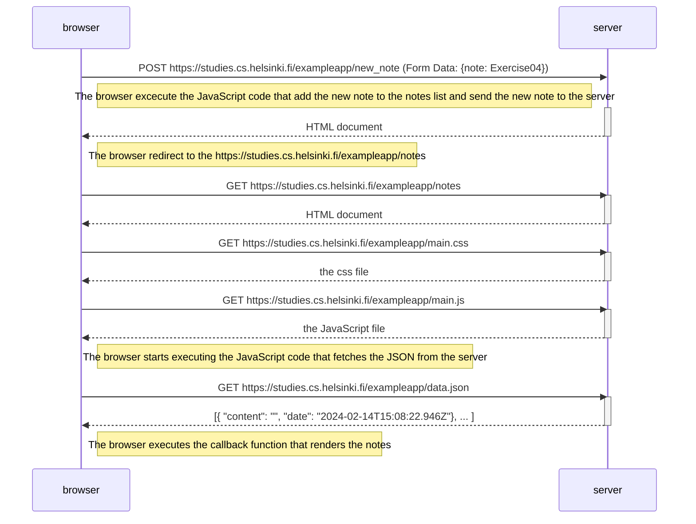

[Exercise 0.4: New note diagram](https://fullstackopen.com/en/part0/fundamentals_of_web_apps#exercises-0-1-0-6)

Create a similar diagram depicting the situation where the user creates a new note on the page https://studies.cs.helsinki.fi/exampleapp/notes by writing something into the text field and clicking the Save button.

A problem may arise here is that even if the request https://studies.cs.helsinki.fi/exampleapp/new_note fails, the note will still display in the notes list.