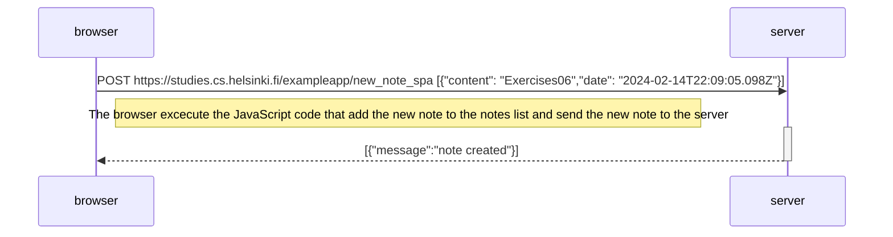

[Exercise 0.6: New note in Single page app diagram](https://fullstackopen.com/en/part0/fundamentals_of_web_apps#exercises-0-1-0-6)

Create a diagram depicting the situation where the user creates a new note using the single-page version of the app.

A problem may arise here is that even if the request https://studies.cs.helsinki.fi/exampleapp/new_note_spa fails, the note will still display in the notes list.